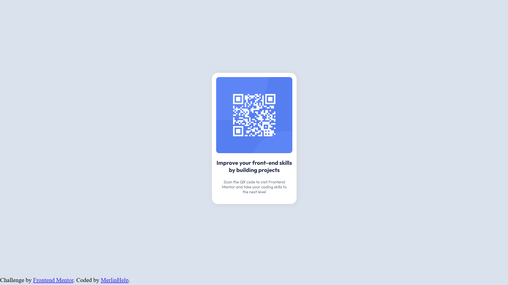

# Frontend Mentor - QR code component solution

This is a solution to the [QR code component challenge on Frontend Mentor](https://www.frontendmentor.io/challenges/qr-code-component-iux_sIO_H). Frontend Mentor challenges help you improve your coding skills by building realistic projects. 

## Table of contents

- [Overview](#overview)
  - [Screenshot](#screenshot)
  - [Links](#links)
- [My process](#my-process)
  - [Built with](#built-with)
  - [What I learned](#what-i-learned)
  - [Useful resources](#useful-resources)
- [Author](#author)

## Overview

### 2048 x 1152 Device Screenshot




### Links

- Live Site URL: [Here](https://merlinhelp.github.io/qr_code_component)

## My process

### Built with

- Semantic HTML5 markup
- CSS custom properties
- Flexbox
- Desktop-First Design

### What I learned

```css
@media (max-width:650px) {
    #box {
        padding: 5vw;
        width: 80vw;
    }

    .outfit-h4 {
        font-size: calc(7vw - 0.8vh);
    }

    .outfit-p {
        font-size: calc(5vw - 0.5vh);
    }
}```

### Useful resources

- [Mozilla Documentation](https://developer.mozilla.org/en-US/docs/Web/CSS/box-shadow) - This page or any of the documentation on this website helps
explains possible styles, elements, and values for styles. Super useful
- [Josh W. Comaeu's Website](https://www.joshwcomeau.com/css/center-a-div/) - This website didn't help too much, but it looks super nice.

## Author

- Website - [Richard Vo](https://github.com/MerlinHelp)
